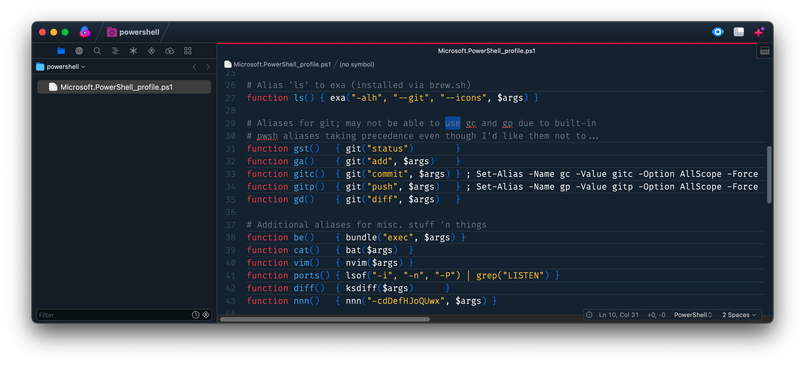

# PowerShell for Nova

This extension enables **syntax highlighting** for [PowerShell](https://github.com/powershell/powershell) in Panic's
[Nova](https://nova.app) text editor.

## THIS IS A WORK IN PROGRESS AND MAY NOT BE FULLY SUITABLE FOR YOUR NEEDS

> _**Caveat emptor.**_
>
> -- Ancient Latin proverb, ["buyer beware"](https://en.wikipedia.org/wiki/Caveat_emptor)

Right now this is a somewhat ugly hack that seems to work, although is admittedly far from feature-complete.

What works:

+ Syntax highlighting (incomplete but mostly functional)

What isn't implemented yet:

+ NO autocomplete
+ NO language server protocol integration
+ Pretty-much everything else

## Feature Requests = Pull Requests

If you'd like a feature that isn't currently here, please understand that this is a side-project for me; I have a full
time job already. The best - and possibly _only_ - way to get that feature implemented would be to do it yourself then
submit a pull request. As long as it works and doesn't break anything (I expect _you_ to do your own testing!) I'll
probably merge it.

License: [BSD-3-Clause](LICENSE.md)
